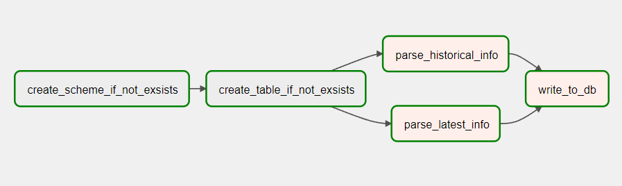
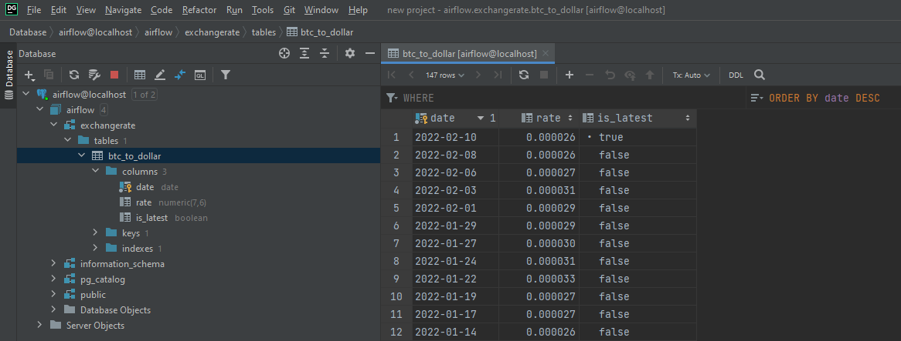

# Задание 2

### Что сделать

___
Используя API [exchangerate.host](https://exchangerate.host/) подготовьте ETL процесс с помощью Airflow на python, для
выгрузки данных по валютной паре BTC/USD (Биткоин к доллару), выгружать следует с шагом 3 часа и записывать данные в
БД (валютная пара, дата, текущий курс).

В качестве задания со звёздочкой можете учесть вариант заполнения базы историческими данными (API предоставляет
специальный endpoint для выгрузки исторических данных).

После подключения к Airflow Webserver-у, надо будет авторизоваться. Данные для авторизации:
<pre>
    <strong>Username:</strong> airflow
    <strong>Password::</strong> airflow
</pre>

Также надо создать Соединение в Веб сервере. Данные для заполнения:
<pre>
    <strong>Connection Id:</strong> airflow
    <strong>Connection Type:</strong> airflow    
    <strong>Host:</strong> postgres
    <strong>Port:</strong> 5432
</pre>
Можете наблюдать работу Dag-a, на нижеуказанной схеме.

&emsp;<strong>1.</strong>&nbsp; Начальные два PostgresOperator-ы были созданы, для того чтобы проверить присутствие
схемы и таблицы, при отсутствие создать их. 
&emsp;<strong>2.</strong>&nbsp; Таски parse_historical_info, parse_latest_info выполняют скрапинг данных с API.
&emsp;<strong>3 .</strong>&nbsp; Таск write_to_db с помощью XCOM получает данные с прошлых двух тасков, и записывает или
обновляет таблицу btc_to_dollar.

Все готово, вы можете запустить DAG, увидеть более полную информацию по нему и наблюдать результат в PostgresDB.

Для проверки записей, я пробросил порт 5432.

